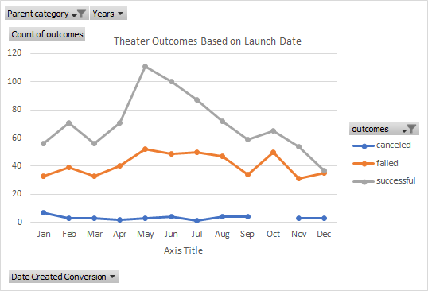
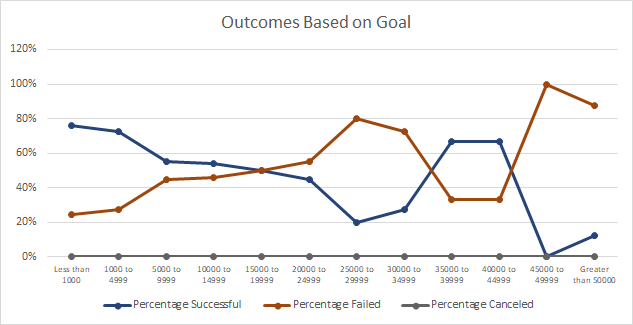

# kickstarter-analysis
Performing analysis on Kickstarter data to uncover trends

# Kickstarting with Excel

## Overview of Project
Louise’s play Fever came close to its fundraising goal in a short amount of time. Now, she wants to know how different campaigns fared in relation to their launch dates and their funding goals. In this study, I'll visualize campaign outcomes based on their launch dates and their funding goals. 

### Purpose
This anaalysis is to determine how different campaigns fared in relation to their launch dates and their funding goals. 

## Analysis and Challenges

### Analysis of Outcomes Based on Launch Date
As it is shown in the chart,overall, succesful cases far more outnumbered failed cases year around for theater categories. The canceled projects remain low and steady for the entire  year.  There are few ups and downs for theater failed and successful categories. The most numbers of successful cases occured during  period from May to June. The lowest point is close to year end.Lots of failed cases occured in October and there is a blank period for canceled projects in October. 

### Analysis of Outcomes Based on Goals
There is no project canceled in the plays categories. The project with goal of less than 1000, between $1000 ~ $19999,$32500~$42500 are more likely to success than other intervals. Goal of $42500 has little chance to be succesful based on the past history. 

### Challenges and Difficulties Encountered
While working on the conuntifs part of the excel, one chanllenge is to verify if the right number of counts were captured. There might be small errors in formulas that could cause drastic differences in results.But that can be solved by using the filter function in the master sheet to double check the number and use countifs to count overall successful,failed or canceled projects.

Another challenge would be figuring out how to use Markdown format and Github to upload my work. Luckily, there are enough resources online so I can figure out quickly.

## Results
- What are two conclusions you can draw about the Outcomes based on Launch Date?
  - Based on the results,it is suggested to luanch the project in early summer, between May and June
- What can you conclude about the Outcomes based on Goals?
  - The goal setting can be successful in different intervals. Goals with less than 2000 has high likelihood to succeed. 
- What are some limitations of this dataset?
  - When comparing luanch date, we don't know how big of production or types of the theater production. if it is a holiday related production, then near holiday could be a more relavant date. For the outcomes based on the goal, we did not count in the live projects. Most importally, we should look at the relationship between pledged and other data. 
- What are some other possible tables and/or graphs that we could create?
  - Numbers of backers based on launch date; Number of backers based on goals; All pledged data in relation to other criteria 
